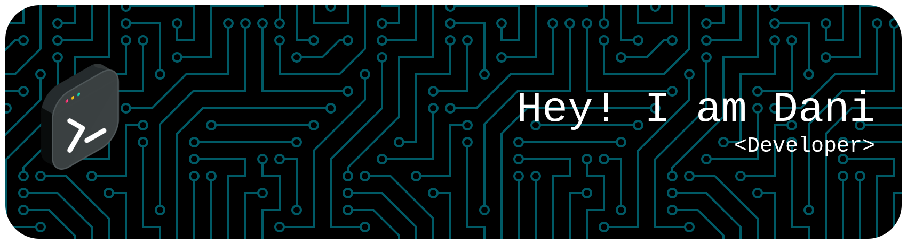

<h3 align="center">💻 Student at <a href="https://www.42madrid.com/" target="_blank">42 Madrid</a> | Passionate about Systems, C Programming & Automation</h3>
<!-- Badges -->

  
  
  
  

### 🚀 About Me

- 🎓 I’m currently a **student at [42 Madrid](https://www.42madrid.com/)**, part of the **42 global network**.  
- 🧠 Constantly learning about **low-level programming, system architecture, and network automation**.  
- ⚙️ I love building tools that make workflows faster and more efficient.  
- 🏗️ Working on projects that combine **C, Bash, and web APIs**.  

---

## 🚀 Common Core Progress

### Cursus Progress

### 📂 My 42 Projects (via the 42 API)

Below you can see a dynamic view of my **completed** and **in-progress** projects fetched from the **42 API**.

> ⚡ This section updates automatically to reflect my real-time progress at 42 Madrid.

<!-- CURSUS START -->
<h4>✅ Completed projects</h4>

  <strong>Born2beroot</strong> 
  ✅ 125

  <strong>ft_printf</strong> 
  ✅ 100

  <strong>get_next_line</strong> 
  ✅ 100

  <strong>Libft</strong> 
  ✅ 125

<h4>🚧 In Progress</h4>

  <strong>Exam Rank 02</strong> 
  🚧 —

  <strong>push_swap</strong> 
  🚧 —

<!-- CURSUS END -->

### Piscine Projects
<!-- PISCINE START -->
<h4>✅ Completed projects</h4>

  <strong>C Piscine C 00</strong> 
  ✅ 85

  <strong>C Piscine C 01</strong> 
  ✅ 100

  <strong>C Piscine C 02</strong> 
  ✅ 55

  <strong>C Piscine C 04</strong> 
  ✅ 85

  <strong>C Piscine C 05</strong> 
  ✅ 80

  <strong>C Piscine C 06</strong> 
  ✅ 100

  <strong>C Piscine C 07</strong> 
  ✅ 60

  <strong>C Piscine C 08</strong> 
  ✅ 100

  <strong>C Piscine Exam 00</strong> 
  ✅ 100

  <strong>C Piscine Exam 01</strong> 
  ✅ 100

  <strong>C Piscine Exam 02</strong> 
  ✅ 90

  <strong>C Piscine Final Exam</strong> 
  ✅ 78

  <strong>C Piscine Rush 00</strong> 
  ✅ 108

  <strong>C Piscine Shell 00</strong> 
  ✅ 70

  <strong>C Piscine Shell 01</strong> 
  ✅ 55

<!-- PISCINE END -->

